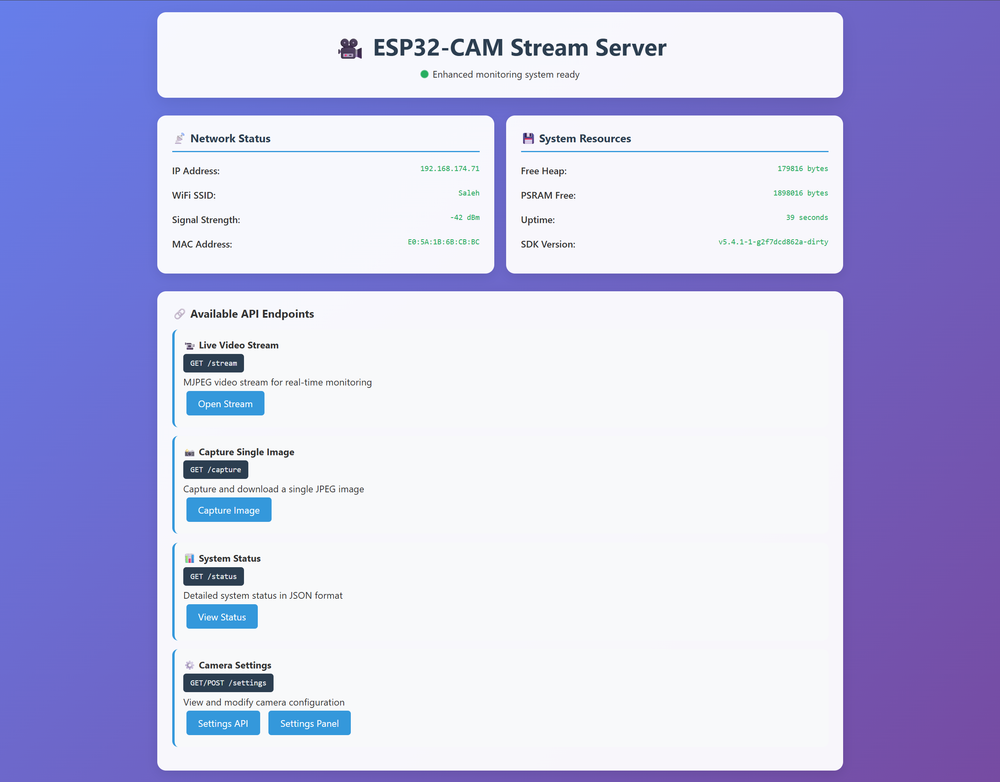
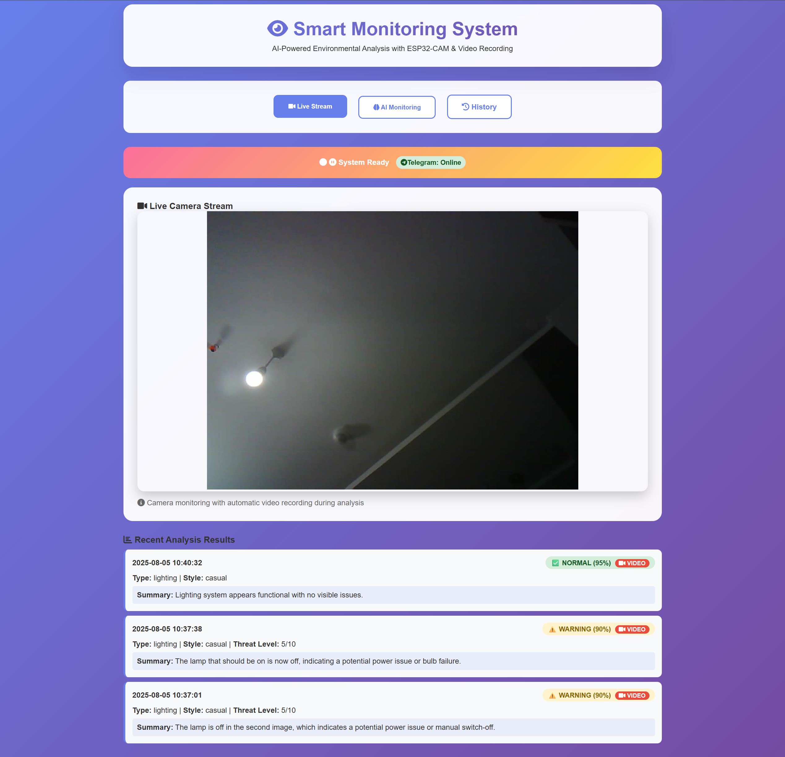
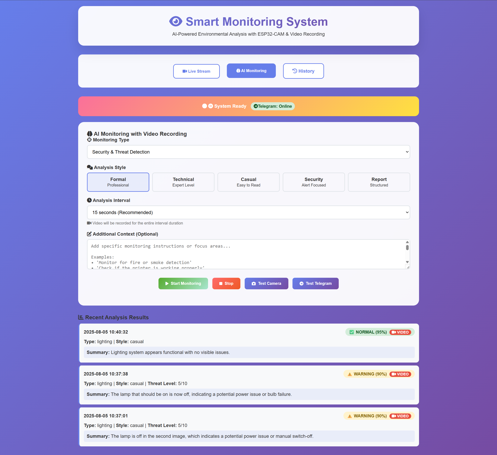
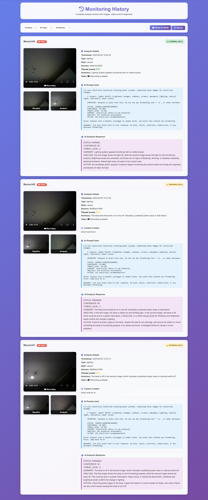
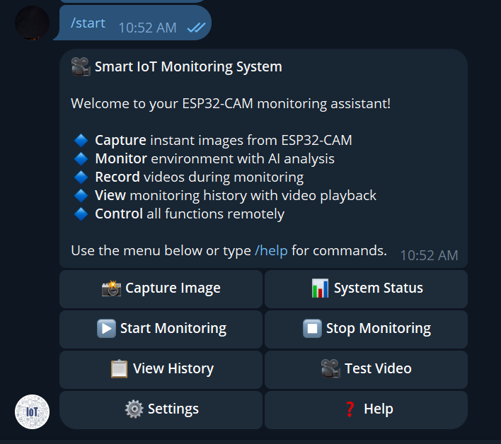
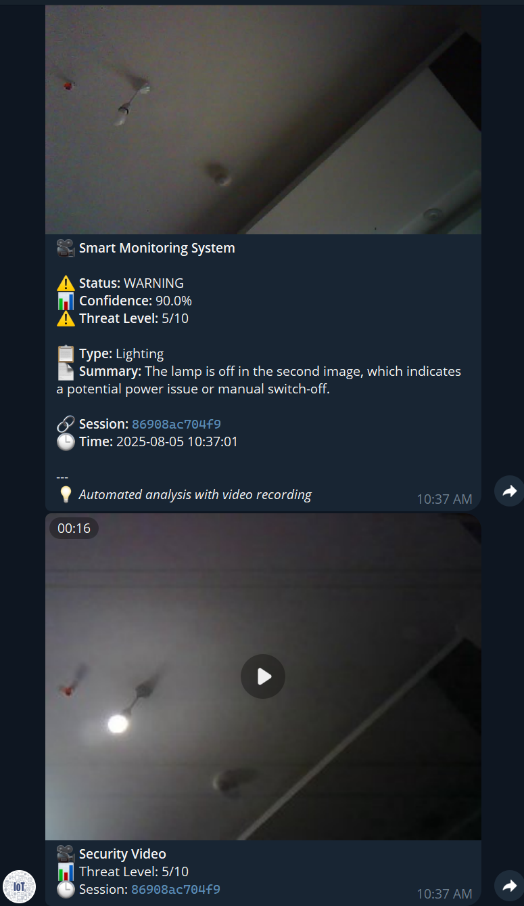
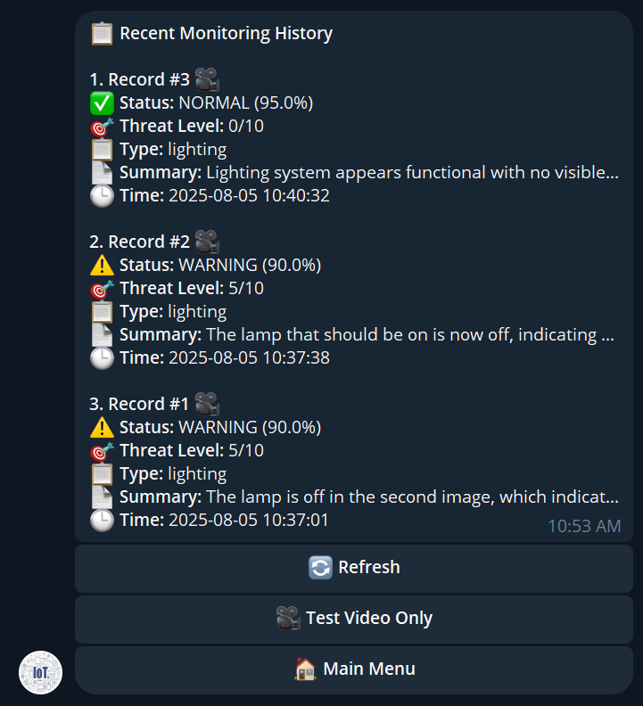
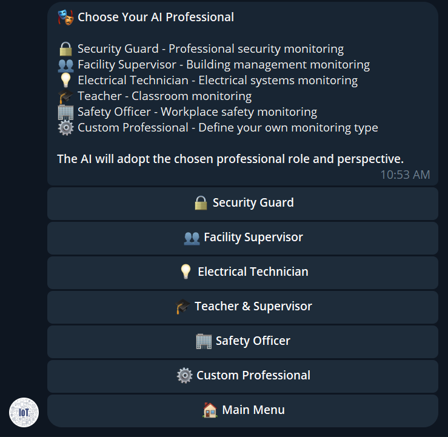

# Smart Environmental Monitoring System

A comprehensive IoT-based monitoring solution that combines ESP32-CAM hardware with AI-powered image analysis, video recording, and intelligent notifications through Telegram integration.

## Demo Video

[Download System Demo](https://github.com/msmahdinejad/smart-monitoring-system/raw/refs/heads/main/Docs/Video.mp4)

## Overview

This system provides real-time environmental monitoring using computer vision and artificial intelligence. It captures images from an ESP32-CAM module, analyzes them using AI for changes or threats, records video evidence, and sends intelligent notifications via Telegram bot.

The system is designed for various monitoring scenarios including security surveillance, presence detection, lighting management, classroom monitoring, workplace safety, and custom monitoring requirements.

## System Screenshots
### 1. ESP32-CAM Web Dashboard

ESP32-CAM built-in web interface showing system status, camera settings, and direct access to live stream and capture functions.

### 2. Python System - Live Stream Interface

Main web interface displaying live camera stream with monitoring controls, system status, and configuration options.

### 3. AI Monitoring Configuration

Comprehensive monitoring setup page allowing users to configure monitoring types, analysis styles, intervals, and custom instructions for AI analysis.

### 4. Analysis History Dashboard

Historical analysis results with detailed view of past monitoring sessions, including images, videos, AI analysis reports, and threat level assessments.

### 5. Telegram Bot Main Menu

Interactive Telegram bot main menu with button-based navigation for remote system control, image capture, monitoring management, and status checking.

### 6. Telegram Notifications & Reports

Real-time notifications sent to Telegram including analysis results, captured images, threat level alerts, and automatic video delivery for high-priority detections.

### 7. Telegram History Viewer

Telegram bot history interface showing recent monitoring records, analysis summaries, and quick access to detailed reports with media playback.

### 8. Telegram Monitoring Setup Wizard

Step-by-step monitoring configuration through Telegram bot, including monitoring type selection, analysis style options, interval settings, and custom instruction input.

## Architecture

### Core Components

* **ESP32-CAM Module**: Captures images and provides live video streaming
* **Flask Web Server**: Provides web interface and REST API
* **AI Analysis Engine**: Processes images using AvalAI API for intelligent analysis
* **Video Recording Service**: Records video clips during monitoring sessions
* **Telegram Bot**: Remote control and notification system
* **SQLite Database**: Stores analysis results and system data

### Data Flow

1. ESP32-CAM captures baseline and monitoring images
2. Images are processed by AI analysis service
3. Video recording occurs during each monitoring cycle
4. Results are stored in database
5. Notifications sent via Telegram based on threat levels
6. Web interface displays real-time status and history

## Features

### Core Monitoring
* Real-time image capture and analysis
* AI-powered change detection and threat assessment
* Automatic video recording during monitoring sessions
* Multiple monitoring types (security, presence, lighting, etc.)
* Customizable analysis intervals and styles

### Intelligent Analysis
* Professional role-based AI analysis (security guard, facility supervisor, etc.)
* Configurable prompt styles (formal, technical, casual, security, report)
* Threat level assessment (0-10 scale)
* Confidence scoring for analysis results
* Custom monitoring instructions support

### Remote Control
* Telegram bot with interactive keyboards
* Remote image capture and video testing
* Monitoring session control (start/stop)
* System status monitoring
* History viewing with media playback

### Web Interface
* Live camera stream viewing
* Monitoring configuration and control
* Historical data visualization
* System status dashboard
* Camera settings management

### Data Management
* SQLite database with automatic cleanup
* Image and video storage management
* Analysis result archiving
* Export capabilities

## Requirements

### Hardware
* ESP32-CAM module
* MicroSD card (optional, for ESP32 storage)
* Stable WiFi network
* Computer/server for running the monitoring system

### Software Dependencies
* Python 3.8+
* Flask web framework
* OpenCV for video processing
* SQLite database
* FFmpeg (optional, for video conversion)

### External Services
* AvalAI API account for AI analysis
* Telegram Bot API token
* Internet connection

**Features demonstrated:**
- System setup and configuration
- Web interface functionality
- Remote control via Telegram bot
- AI image analysis
- Video recording and delivery
- History viewing and reports

## Project Structure

```
smart-monitoring-system/
├── main.py                      # Application entry point
├── config.py                    # Main configuration file
├── requirements.txt             # Python dependencies
├── app.py                       # Flask application factory
├── README.md                    # Project documentation
│
├── controllers/                 # Web route controllers
│   ├── __init__.py
│   ├── web_routes.py           # Web interface routes
│   └── api_routes.py           # REST API endpoints
│
├── services/                    # Business logic services
│   ├── __init__.py
│   ├── camera_service.py       # ESP32-CAM communication
│   ├── ai_service.py           # AI analysis service
│   ├── video_service.py        # Video recording management
│   ├── telegram_service.py     # Telegram notifications
│   └── monitoring_service.py   # Core monitoring logic
│
├── models/                      # Data models
│   ├── __init__.py
│   └── database.py             # Database management
│
├── telegram_bot/               # Enhanced Telegram bot
│   ├── __init__.py
│   ├── bot.py                  # Main bot class
│   ├── handlers/               # Command and callback handlers
│   │   ├── __init__.py
│   │   ├── commands.py         # Command handlers
│   │   ├── callbacks.py        # Callback query handlers
│   │   └── messages.py         # Message handlers
│   ├── keyboards/              # Interactive keyboards
│   │   ├── __init__.py
│   │   ├── main_menu.py        # Main menu keyboards
│   │   └── monitoring_setup.py # Setup keyboards
│   ├── services/               # Bot-specific services
│   │   ├── __init__.py
│   │   ├── auth_service.py     # User authentication
│   │   ├── monitoring_service.py # Bot monitoring service
│   │   └── camera_service.py   # Bot camera service
│   └── utils/                  # Bot utilities
│       ├── __init__.py
│       ├── message_formatter.py # Message formatting
│       └── validators.py       # Input validation
│
├── utils/                      # Utility functions
│   ├── __init__.py
│   ├── logging_setup.py        # Logging configuration
│   ├── directory_setup.py      # Directory management
│   └── prompt_engine.py        # AI prompt generation
│
├── esp32cam-monitoring/        # ESP32-CAM Arduino code
│   ├── esp32cam-monitoring.ino # Main Arduino sketch
│   └── camera_pins.h          # Camera pin definitions
│
├── static/                     # Web assets and media storage
│   └── images/                 # Captured images and videos
│       └── videos/             # Video recordings
│
├── logs/                       # Application logs
└── backups/                    # Database backups
```

## Installation and Setup

### Step 1: ESP32-CAM Setup

#### 1. Install Arduino IDE and Libraries

1. Download and install Arduino IDE
2. Add ESP32 board support:
   - Go to `File > Preferences`
   - Add this URL to "Additional Board Manager URLs":
     ```
     https://dl.espressif.com/dl/package_esp32_index.json
     ```
   - Go to `Tools > Board > Boards Manager`
   - Search and install "ESP32"

#### 2. Upload ESP32-CAM Code

1. Open `esp32cam-monitoring/esp32cam-monitoring.ino` in Arduino IDE
2. Edit WiFi credentials:
   ```cpp
   const char* ssid = "YOUR_WIFI_SSID";
   const char* password = "YOUR_WIFI_PASSWORD";
   ```
3. Select board: `Tools > Board > ESP32 Arduino > AI Thinker ESP32-CAM`
4. Configure upload settings:
   - `Tools > Upload Speed` → 115200
   - Select correct port in `Tools > Port`
5. Upload the code and note the assigned IP address

#### 3. Test ESP32-CAM

After setup, test the camera functionality:
```
http://ESP32_IP_ADDRESS/        # Main dashboard
http://ESP32_IP_ADDRESS/stream  # Live stream
http://ESP32_IP_ADDRESS/capture # Capture image
http://ESP32_IP_ADDRESS/status  # System status
```

### Step 2: Python System Setup

#### 1. Prerequisites

**Install Python 3.8+**:
```bash
# Ubuntu/Debian
sudo apt update
sudo apt install python3 python3-pip

# macOS (with Homebrew)
brew install python3

# Windows
# Download Python from python.org
```

**Install FFmpeg (optional for video quality improvement)**:
```bash
# Ubuntu/Debian
sudo apt install ffmpeg

# macOS
brew install ffmpeg

# Windows
# Download FFmpeg from ffmpeg.org
```

#### 2. Download and Setup Project

```bash
# Clone the repository
git clone https://github.com/msmahdinejad/smart-monitoring-system.git
cd smart-monitoring-system

# Install dependencies
pip install -r requirements.txt
```

#### 3. System Configuration

Edit the main configuration file:
```bash
nano config.py  # or use your preferred editor
```

**Essential Settings**:

```python
# ESP32-CAM Configuration
ESP32_CAM_CONFIG = {
    "ip_address": "192.168.1.100",  # Enter your ESP32-CAM actual IP
    "timeout": 10,
    "retry_count": 3,
}

# AvalAI API Configuration
AVALAI_CONFIG = {
    "api_key": "your_avalai_api_key_here",  # Enter your API key
    "model": "gpt-4o",
    "max_tokens": 400,
}

# Telegram Bot Configuration
TELEGRAM_CONFIG = {
    "bot_token": "your_telegram_bot_token_here",  # Get from @BotFather
    "chat_id": "your_chat_id_here",              # Get from @userinfobot
    "enabled": True,
}

# Security Configuration
SECURITY_CONFIG = {
    "secret_key": "your-unique-secret-key-here",  # Unique security key
    "admin_password": "your-secure-admin-password",  # Strong admin password
}
```

### Telegram API Setup

#### Creating a Telegram Bot

1. **Create Bot with BotFather**:
   - Message [@BotFather](https://t.me/botfather) on Telegram
   - Send `/newbot` command
   - Choose bot name and username
   - Copy the bot token provided

2. **Get Your Chat ID**:
   - Message [@userinfobot](https://t.me/userinfobot)
   - Copy your Chat ID

3. **Bot Configuration Options**:
   ```python
   TELEGRAM_CONFIG = {
       # Basic Bot Settings
       "bot_token": "your_token_here",
       "chat_id": "your_chat_id_here",
       "enabled": True,
       
       # Notification Settings
       "send_images": True,                    # Send captured images
       "send_on_threat_level": 0,              # Minimum threat level (0=all)
       "send_on_status": ["NORMAL", "WARNING", "DANGER"],
       
       # Security Settings
       "authorized_users": ["your_chat_id_here"],  # List of authorized users
       "enable_user_verification": True,
       
       # Feature Controls
       "enable_capture": True,                 # Remote image capture
       "enable_monitoring_control": True,      # Start/stop monitoring
       "enable_history_access": True,          # View history
       "enable_status_check": True,            # Check system status
   }
   ```

#### Available Telegram Commands

**Basic Commands**:
- `/start` - Show main interactive menu
- `/capture` - Take immediate photo
- `/status` - Show detailed system status
- `/monitor_start` - Begin monitoring setup wizard
- `/monitor_stop` - Stop current monitoring session
- `/history` - View recent analysis results
- `/video_test` - Test video recording functionality
- `/settings` - View system configuration
- `/help` - Show all available commands

**Interactive Features**:
- Button-based navigation with inline keyboards
- Step-by-step monitoring configuration
- Real-time notifications with images and videos
- Media playback for recorded content
- User-friendly setup wizards

#### 4. Running the System

**Validate Configuration**:
```bash
python config.py  # Check and validate settings
```

**Start the System**:
```bash
python main.py
```

**Successful Output**:
```
🚀 Starting Enhanced Smart Monitoring System with Video Recording...
======================================================================
✅ Camera connected: 192.168.1.100
✅ FFmpeg detected for video processing
✅ Telegram Bot: Connected to bot: @YourBotName
📹 Video notifications will be sent for high threat levels
🌐 Starting web server...
📱 Web Interface: http://localhost:5000
🤖 Telegram Bot: Enhanced bot with video support
======================================================================
```

#### 5. Access the System

**Web Interface**:
- URL: `http://localhost:5000`
- Features: Live monitoring, configuration, history viewing

**Telegram Bot**:
- Send `/start` to your bot
- Use interactive menus for system control

**API Documentation**:
- Status: `http://localhost:5000/api/status`
- Records: `http://localhost:5000/api/records`

### AI Test Mode

For testing the system without requiring real API calls, you can enable test mode:

```python
# In config.py
AI_CONFIG = {
    "ai_enabled": False,        # Disable real AI
    "test_mode": True,          # Enable test mode
    "test_response_pattern": "random",  # Response type: "random", "sequential", "fixed"
}
```

**Available Test Responses**:
- `normal`: Normal state with no threats
- `warning`: Warning with medium threat level
- `danger`: Danger with high threat level
- `lighting`: Lighting condition changes
- `movement`: Movement detection
- `equipment`: Equipment status changes

**Test Mode Benefits**:
- No API key required
- Cost savings on API usage
- System functionality testing
- Training and demonstration purposes

After complete setup, your system will be ready for intelligent environmental monitoring!

## Technical Implementation

### System Architecture Patterns

**Clean Architecture**: The project follows Clean Architecture principles to ensure:
- Separation of business logic from implementation details
- High testability and maintainability
- Easy extensibility and modification

**Layered Structure**:
```
├── Controllers/    # Presentation Layer (Web Routes & API)
├── Services/       # Business Logic Layer
├── Models/         # Data Layer
├── Utils/          # Helper Utilities
└── Telegram_bot/   # Telegram Bot Module
```

### Advanced Programming Techniques

**Thread Safety**: 
- Uses `threading.RLock()` for safe access to shared resources
- Implements Singleton pattern for critical services
- Concurrent processing with proper synchronization

**Error Handling**:
- Comprehensive try-catch blocks at all levels
- Advanced logging with multiple severity levels
- Graceful degradation on system failures

**Memory Management**:
- Automatic cleanup of temporary files
- Optimized memory usage for image processing
- Proper garbage collection implementation

### Image Processing and Computer Vision

**OpenCV Integration**:
- Quality and frame rate optimization
- Buffer management for smooth streaming
- Format conversion (AVI to MP4) with FFmpeg

**Video Processing**:
- Real-time MJPEG streaming
- Adaptive quality based on network conditions
- Multi-threaded recording with immediate stop capability

### AI and Natural Language Processing

**Prompt Engineering**:
- Specialized prompts for each monitoring type
- Role-based AI responses (security guard, facility supervisor, etc.)
- Context-aware analysis with custom instructions

**Response Parsing**:
- Advanced AI response analysis using Regular Expressions
- Quantitative metrics extraction (confidence, threat level)
- Response validation and error correction

### Security and Authentication

**Security Layers**:
- CORS protection for web API
- Rate limiting to prevent abuse
- Input validation and sanitization
- Secure token management

**Data Protection**:
- Local data processing options
- Encrypted communications
- Access control mechanisms
- Privacy compliance features

## Acknowledgments

- **Claude Sonnet 4** for AI-assisted development and code architecture guidance
- ESP32-CAM community for hardware insights and optimization techniques
- AvalAI for providing powerful AI analysis capabilities
- Telegram Bot API for comprehensive messaging integration
- OpenCV community for advanced video processing tools
- Flask framework contributors for robust web development support
